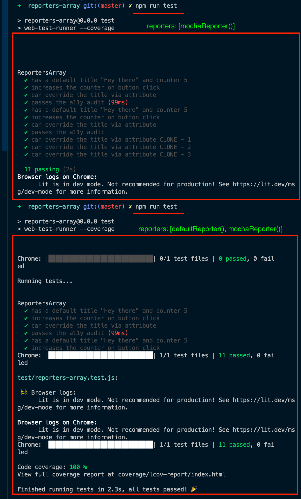

## When a new report is added the results of these overlap

- with `reporters: [mochaReporter()]`
  - the `log` is correct and the 11 test are displayed

<hr>

- with `reporters: [defaultReporter(), mochaReporter()]`
  - both `logs` are mixed


<hr>




### web-test-runner.config.mjs
```js
import { defaultReporter } from "@web/test-runner";
import { mochaReporter } from "@chialab/wtr-mocha-reporter";

const filteredLogs = ["Running in dev mode", "lit-html is in dev mode"];

export default /** @type {import("@web/test-runner").TestRunnerConfig} */ ({
  /** Test files to run */
  files: "test/**/*.test.js",

  /** Resolve bare module imports */
  nodeResolve: {
    exportConditions: ["browser", "development"],
  },

   // OK
  //reporters: [mochaReporter()],

  // OK
  // reporters: [defaultReporter()],

  // fail
   reporters: [defaultReporter(), mochaReporter()],

  // fail
  /*  reporters: [
    defaultReporter({
      reportTestResults: false,
      reportTestProgress: true,
    }),
    mochaReporter(),
  ], */

  // OK
  /* reporters: [
    defaultReporter({
      reportTestResults: false,
      reportTestProgress: false,
    }),
    mochaReporter(),
  ], */

  // more or less
  /*  reporters: [
    defaultReporter({
      reportTestResults: true,
      reportTestProgress: false,
    }),
    mochaReporter(),
  ], */
  ...
  ...
  ...
});
```


# \<reporters-array>

This webcomponent follows the [open-wc](https://github.com/open-wc/open-wc) recommendation.

## Installation

```bash
npm i reporters-array
```

## Usage

```html
<script type="module">
  import 'reporters-array/reporters-array.js';
</script>

<reporters-array></reporters-array>
```

## Testing with Web Test Runner

To execute a single test run:

```bash
npm run test
```

To run the tests in interactive watch mode run:

```bash
npm run test:watch
```


## Tooling configs

For most of the tools, the configuration is in the `package.json` to minimize the amount of files in your project.

If you customize the configuration a lot, you can consider moving them to individual files.

## Local Demo with `web-dev-server`

```bash
npm start
```

To run a local development server that serves the basic demo located in `demo/index.html`
